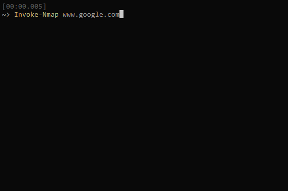
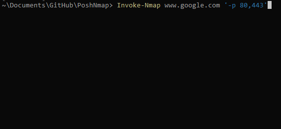
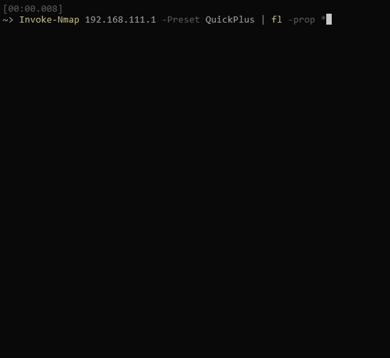

# PoshNmap

[![PSGallery][]][PSGalleryLink] [![PSGalleryDL][]][PSGalleryDLLink]

[![ADO][]][ADOLink] [![GHRelease][]][GHReleaseLink]

[![ADOvNext][]][ADOvNextLink] [![GHPreRelease][]][GHPreReleaseLink]

---

This project's goal is to deliver an effective wrapper around the Nmap Network Discovery tool, providing Powershell-y behavior and sensible autocomplete as well as formatting output into usable, parseable Powershell objects for better filtering and analysis than trying to use the nmap raw text or XML output formats.

# Why

People are constantly trying to reinvent the wheel on network discovery in Powershell, via Test-Netconnection, Test-Connection, ping sweep scripts. Immediately they realize the timeout issues with these options make them slow, slow, slow. Nmap is an extremely well optimized and mature tool for this purpose, and available everywhere Powershell Core is. However, its syntax is obtuse, and its default output does not lend itself well to parsing and analytics by other tools. PoshNmap aims to solve those problems by providing a friendly Powershell interface to the tool.

# Features
* PS 5.1 and Core Compatible
* Powershell Cmdlet to interact with Nmap in a friendly way.
* Intellisense and Tab Autocomplete for relevant parameters (-Preset, -OutFormat, etc.)
* Power users can do advanced scans with -ArgumentList parameter
* Real time status updates via Write-Progress including percent complete and ETA
* Default output is a friendly list of Powershell objects representing scanned hosts
* Multiple output format options: Raw Nmap, XML, JSON, PSObject, Hashtable
* Detailed Verbose output including the underlying nmap command line that was run

# Demo

## Simple Scan

## Simple Scan with Custom Arguments (nmap-style)

## Scan of Home Router using QuickPlus Preset (Includes OS/Service Fingerprinting)

## Scan using various output formats

# Installation

Visit the [Powershell Gallery](https://www.powershellgallery.com/packages/PoshNmap) for installation options.

You must also have Nmap already installed and in your path. Visit nmap.org for various install options. It is usually available in Various package managers, and is available in Chocolatey for windows with `choco install nmap`

# Output Notes

Currently all outputs but the default PoshNmap output can be considered "stable" and used as input to other scripts or commands. The PoshNmap output "nmapResult" property is also stable, however all other properties should be considered "in flux" and may change in minor revisions "0.x.0" without notice until this project reaches 1.0.0

[PSGallery]: https://img.shields.io/powershellgallery/v/PoshNmap.svg?logo=windows&label=Powershell+Gallery+Latest
[PSGalleryLink]: https://www.powershellgallery.com/packages/PoshNmap

[PSGalleryDL]: https://img.shields.io/powershellgallery/dt/PoshNmap.svg?logo=windows&label=downloads
[PSGalleryDLLink]: https://www.powershellgallery.com/packages/PoshNmap

[GHRelease]:https://img.shields.io/github/downloads/justingrote/PoshNmap/latest/total.svg?logo=github&label=download
[GHReleaseLink]: https://github.com/JustinGrote/PoshNmap/releases/latest

[GHPreRelease]: https://img.shields.io/github/downloads-pre/justingrote/PoshNmap/total.svg?logo=github&label=download
[GHPreReleaseLink]: https://github.com/JustinGrote/PoshNmap/releases

[ADO]: https://dev.azure.com/justingrote/Github/_apis/build/status/JustinGrote.PoshNmap?branchName=master&label=Current
[ADOLink]: https://dev.azure.com/justingrote/Github/_build?definitionId=4

[ADOVNext]: https://dev.azure.com/justingrote/Github/_apis/build/status/JustinGrote.PoshNmap?branchName=release/vNext&label=vNext
[ADOVNextLink]: https://dev.azure.com/justingrote/Github/_build?definitionId=4
